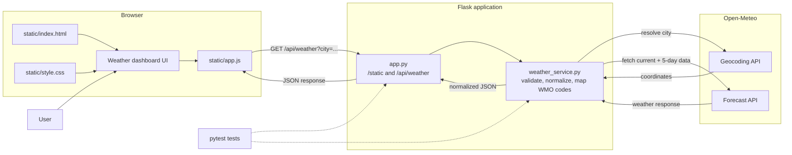
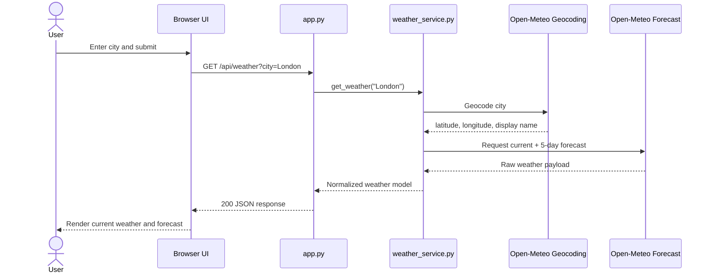
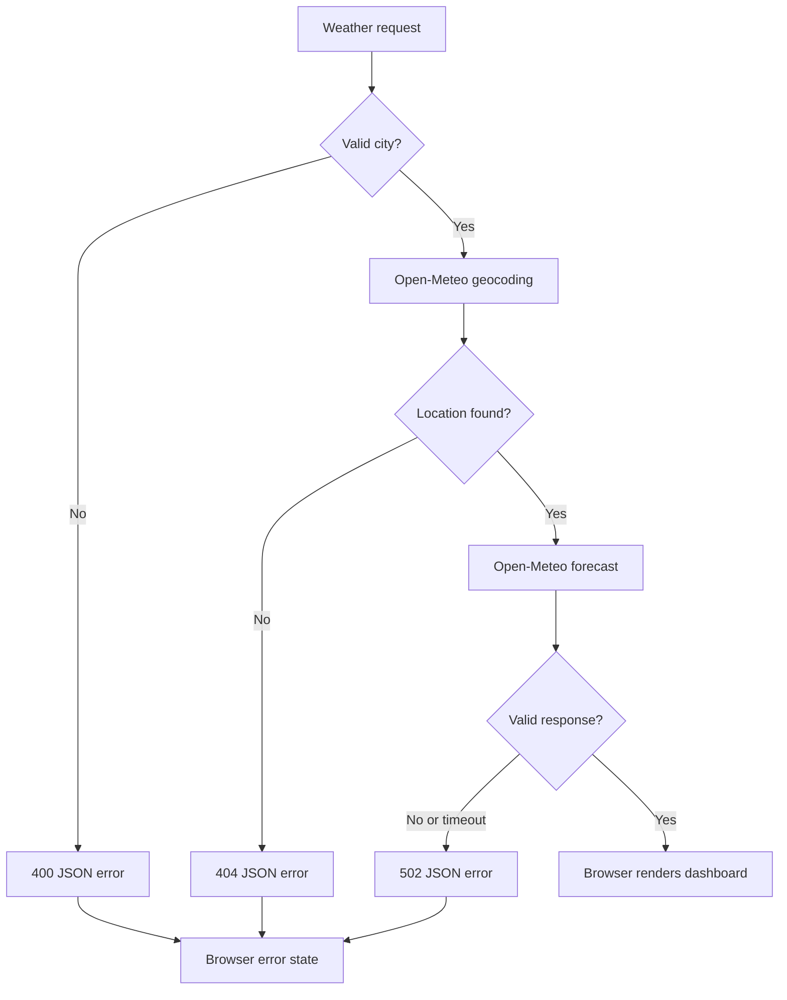

## Plan: Weather Dashboard MVP

Build a greenfield Flask weather dashboard with a plain HTML, CSS, and JavaScript frontend backed by Open-Meteo. The browser will search for a city through a Flask JSON endpoint, render current conditions and a five-day forecast, and provide polished responsive loading, empty, and error states without a frontend framework or build step.

**Architecture**

Browser layer (`static/index.html`, `static/style.css`, `static/app.js`) -> Flask application (`app.py`) -> weather service (`weather_service.py`) -> Open-Meteo geocoding and forecast APIs. Flask serves the static frontend and exposes `/api/weather`; the browser never calls Open-Meteo directly.

Architecture diagram: Browser UI -> Flask static-file route; Browser JavaScript -> `/api/weather?city=...` -> weather service -> Open-Meteo Geocoding API and Forecast API; normalized JSON returns along the same path to the browser UI.

**Data Flow**

1. The user enters a city in the browser and submits the search form.
2. `static/app.js` validates the input, shows loading state, and sends a request to Flask's `/api/weather` endpoint.
3. `app.py` passes the city to `weather_service.py`.
4. The service calls Open-Meteo Geocoding to resolve the city to latitude, longitude, and display name.
5. The service calls Open-Meteo Forecast with that location and requests current plus five daily weather values.
6. The service validates and normalizes the upstream response, maps WMO codes to presentation labels/icons, and returns a compact JSON view model.
7. Flask returns the JSON response; JavaScript renders the current conditions and five-day forecast, then clears loading state.
8. Unknown cities, malformed responses, network timeouts, and upstream failures return a user-safe error response that the browser renders without exposing provider details.

**Request/response paths**

- Success: `Browser -> Flask -> Weather service -> Open-Meteo -> Weather service -> Flask JSON -> Browser render`
- Unknown city: `Browser -> Flask -> Geocoding -> no result -> Flask 404 JSON -> Browser error state`
- Provider failure: `Browser -> Flask -> Weather service -> timeout/error -> Flask 502 JSON -> Browser error state`

**Architecture Diagram**

**Architecture Responsibilities**

- Browser: presents the search form and weather results; manages loading, empty, success, and error states.
- `app.py`: serves static assets, validates the request boundary, calls the service, and returns JSON with appropriate status codes.
- `weather_service.py`: resolves city names, calls Open-Meteo, validates provider responses, normalizes the view model, and maps WMO codes.
- Open-Meteo: provides geocoding and weather data; it is never called directly by browser JavaScript.
- Tests: mock Open-Meteo and verify service normalization plus Flask route behavior.

**Primary Request Flow**

**Failure Flow**

**Steps**
1. Scaffold the Python project dependencies and Flask app entry point in `app.py`; serve the static frontend and expose a JSON weather endpoint with a reusable HTTP client timeout.
2. Add a weather service layer in `weather_service.py` that calls Open-Meteo's geocoding and forecast endpoints, validates required response fields, maps WMO weather codes to labels/icons, and returns normalized current plus five-day data. Keep network errors and unknown locations as explicit application errors.
3. Add `static/index.html` with the dashboard shell: city search form, current-weather region, metric tiles, forecast container, and accessible loading/error/empty states. Keep the first viewport useful on desktop and mobile.
4. Add `static/style.css` with a distinctive but restrained weather-focused visual system, responsive layout, stable card dimensions, visible focus states, and small page-load/forecast reveal motion.
5. Add `static/app.js` to submit searches with `fetch`, manage loading and error states, render normalized weather data, format dates/units, and prevent stale responses from overwriting newer searches.
6. Add focused tests for weather-code mapping, response normalization, Flask JSON route behavior, and a short README with setup, run, and Open-Meteo notes.
7. Verify with the test suite, a Flask startup check, and a manual browser check for a valid city, unknown city, and upstream failure.

**Relevant files**
- `c:\co-pilot\septkpiapp\app.py` — Flask app factory/routes and request handling.
- `c:\co-pilot\septkpiapp\weather_service.py` — Open-Meteo integration, normalization, code mapping, and error boundary.
- `c:\co-pilot\septkpiapp\static\index.html` — dashboard shell and accessible form/status regions.
- `c:\co-pilot\septkpiapp\static\style.css` — responsive visual design and motion.
- `c:\co-pilot\septkpiapp\static\app.js` — fetch lifecycle, rendering, formatting, and stale-request handling.
- `c:\co-pilot\septkpiapp\tests\test_weather_service.py` — service unit tests with mocked responses.
- `c:\co-pilot\septkpiapp\tests\test_app.py` — route and error-state tests.
- `c:\co-pilot\septkpiapp\requirements.txt` — Flask and HTTP client dependencies.
- `c:\co-pilot\septkpiapp\README.md` — local setup and usage.

**Verification**
1. Run `python -m pytest` with network calls mocked.
2. Run `python -m compileall .` to catch syntax errors.
3. Start Flask locally and check a known city such as London, an unknown city, and a simulated upstream error.
4. Inspect desktop and narrow mobile layouts for overflow, readable forecast rows, focus visibility, and non-overlapping content.

**Decisions**
- Use Flask because the workspace is empty and it provides a small JSON backend for the vanilla frontend.
- Use Open-Meteo geocoding plus forecast APIs; no API key or account is required.
- MVP includes one searched city, current conditions, and five daily forecast entries. Saved cities, hourly charts, authentication, database persistence, and deployment configuration are excluded until the core flow is working.
- Use a static HTML shell and vanilla JavaScript `fetch` calls against Flask JSON; avoid Jinja templates, a JavaScript framework, and a frontend build pipeline.

**Further Considerations**
1. Add browser-side autocomplete only after the basic city lookup flow is verified.
2. Preserve the last successful city in the query string so refresh/share behavior stays predictable.
